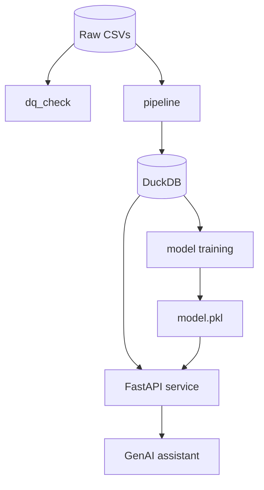

# Supply Chain Intelligence Mini-Platform

A production-ready thin slice of an end-to-end supply chain intelligence platform. The repo ingests and profiles raw shipping data, stores it in DuckDB, trains a delay-risk model, exposes a FastAPI service, and supports a GenAI assistant for route and shipment analysis.

## What is included

- Data profiling and quality checks for raw logistics CSV files
- ETL pipeline to curate shipments, ports, and port events into DuckDB
- ML training pipeline with a gradient-boosting delay-risk model
- FastAPI analytics and prediction endpoints
- CLI assistant that can query route stats, shipment history, and delay forecasts
- Docker Compose setup for a one-command local deployment

## Repository structure

```text
.
├── .github/workflows/train.yaml
├── data/
│   ├── ports.csv
│   ├── shipments.csv
│   └── port_events.csv
├── src/
│   ├── agent/
│   ├── api/
│   ├── data/
│   ├── ml/
│   └── cli.py
├── Dockerfile
├── docker-compose.yml
├── pyproject.toml
├── requirements.txt
├── README.md
├── dq_report.json
├── model.pkl
├── supply_chain.db
├── tests/
└── Take_Home_Assignment.pdf
```

## Quick start

### 1) Install dependencies

```bash
python -m venv .venv
source .venv/bin/activate   # Windows: .venv\Scripts\activate
pip install --upgrade pip
pip install -e ".[dev]"
```

### 2) Build the data-quality report

```bash
python -m src.data.dq_check --input ./data
```

This generates `dq_report.json` at the repository root.

### 3) Ingest data into DuckDB

```bash
python -m src.data.pipeline --input ./data
```

This creates or refreshes `supply_chain.db` in the repository root.

### 4) Train the ML model

```bash
python -m src.ml.train
```

This generates `model.pkl` in the repository root.

### 5) Run the API locally

```bash
uvicorn src.api.main:app --reload --port 8000
```

Then visit:

- `http://localhost:8000/health`
- `http://localhost:8000/docs`

### 6) Run the tests

```bash
pytest tests/
```

### 7) Start the GenAI assistant

```bash
export GEMINI_API_KEY=your_api_key
python -m src.agent.assistant
```

## Docker Compose

```bash
docker compose up --build
```

This starts the FastAPI service on `http://localhost:8000`.

## Key endpoints

- `GET /health`
- `GET /data-quality/report`
- `GET /shipments`
- `GET /shipments/{shipment_id}`
- `GET /routes/{origin}/{destination}/stats`
- `POST /predict-delay`

## Important runtime note

The project now resolves generated artifacts and the database relative to the repository root instead of the current shell location. This avoids failures when the app is launched from a different working directory.

## CI and validation

The repository includes a GitHub Actions workflow in `.github/workflows/train.yaml` that checks:

- data quality generation
- ETL pipeline execution
- model training
- Python linting and packaging
- Docker image build

## Data quality summary

The default checks include:

- missing planned departures
- arrival before departure
- negative shipment weights
- missing timezone info
- negative delay values

## Architecture summary



## Production considerations

This is a lightweight mini-platform, not a full enterprise logistics platform. For larger production workloads, the next steps would include:

- managed PostgreSQL or ClickHouse for serving
- streaming ingestion for event data
- model versioning and deployment automation
- VPC/secret management for API keys and credentials

## License

This project is licensed under the MIT License.

## Tech Choices & Architectural Tradeoffs

* **Data Store: DuckDB** 
  * *Why:* The platform primarily serves analytical aggregations (route stats, percentiles) and ML feature extraction. DuckDB runs in-process with zero operational network overhead, natively executes vectorized columnar queries over CSVs, and avoids the maintenance footprint of an external PostgreSQL instance for a single-node API.
* **API Framework: FastAPI** 
  * *Why:* High-performance asynchronous execution, native OpenAPI auto-documentation, and strict schema validation via Pydantic v2. This guarantees type safety across shipment payloads and ML inference inputs with minimal boilerplate.
* **ML Framework: Scikit-Learn (HistGradientBoostingClassifier)** 
  * *Why:* For tabular transit delay classification, an interpretable ensemble provides explainable feature importances and handles non-linear relationships natively without the heavy GPU overhead of deep learning runtimes.
* **GenAI / LLM Provider: Google Gemini (`google-generativeai`)** 
  * *Why:* High token efficiency and fast JSON structured function/tool calling support, allowing rich multi-turn agent execution with highly reliable guardrails.
* **Test & CI Tooling: Pytest, Ruff, GitHub Actions** 
  * *Why:* `ruff` replaces Black, Flake8, and isort with 10–100x faster execution in Rust. `pytest-cov` guarantees deterministic coverage gates before merging.
* **Scope Judgment: What We Skipped & Why**
  * *Distributed Message Brokers (Kafka / RabbitMQ):* While event logs mimic streaming telemetry, introducing a full event broker for a small dataset introduces excessive operational complexity without functional value for this thin slice.
  * *Deep Learning:* Tabular operational data does not justify neural network complexity; tree-based models are deterministic, fast to train, and easily serializable.
  * *Frontend UI:* Engineering time was prioritized entirely on backend rigor (data quality audits, >80% test coverage, structured JSON observability, and robust LLM tool calling).

## Comprehensive Data Quality Summary

A standalone profiling script (`src/data/dq_check.py`) executes against the raw data before ingestion to identify embedded anomalies. 

| Entity | Issue Detected | Rows Affected | Severity | Action | Reasoning |
|---|---|---|---|---|---|
| **Shipments** | Negative weights | 36 | Critical | Drop/Quarantine | Physical container weights cannot be negative. |
| **Shipments** | Invalid UN/LOCODEs | 95 | Critical | Drop | Shipments with unmapped origin/destination ports cannot be routed. |
| **Shipments** | Zero/Negative containers | 23 | Critical | Drop/Quarantine | A valid shipment must represent at least one physical container. |
| **Shipments** | Duplicate shipment IDs | 28 | Critical | Drop | `shipment_id` is a primary key; duplicates violate ingestion constraints. |
| **Shipments** | Chronological inversions | 39 | Warning | Drop | Booking date is recorded *after* actual departure, indicating system latency or entry error. |
| **Shipments** | Missing status | 54 | Warning | Impute | Flagged and defaulted to 'UNKNOWN' to prevent null-reference errors. |
| **Shipments** | Missing weights | 73 | Warning | Impute | Flagged; median imputation used to retain records for ML feature engineering. |
| **Shipments** | Inconsistent status casing | 92 | Warning | Fix | Values like `COMPLETED`, `Complete`, and `delivered` standardized to `DELIVERED`. |
| **Shipments** | Missing cargo type | 15 | Info | Impute | Filled with 'OTHER' as it is non-critical for basic routing. |
| **Ports** | Missing country | 1 | Info | Fix | Belgium imputed for port `BEANR` (Antwerp) to restore region grouping capabilities. |
| **Events** | Orphaned events | 207 | Warning | Drop | Telemetry exists for vessels that do not map to any active shipments. |
| **Events** | Missing event types | 140 | Critical | Drop | Unclassified events provide no actionable telemetry. |
| **Events** | Duplicate event IDs | 103 | Critical | Drop | Event tracking streams must rely on unique identifiers. |

## CI/CD Pipeline

The project implements a fully working CI/CD pipeline via GitHub Actions (`.github/workflows/train.yaml`).
* **Pipeline Stages:**
  1. Checks out the repository and configures Python 3.11.
  2. Installs pinned dependencies cleanly to avoid resolver conflicts.
  3. Executes the standalone `dq_check.py` data profiling module.
  4. Runs the idempotent DuckDB ingestion pipeline.
  5. Trains and serializes the ML model.
  6. Executes the unified `pykit check` (Ruff linting/formatting and Pytest suite with an enforced >80% coverage gate).
  7. Validates the Docker container build.
* **Quality Gates:** Code cannot be merged unless linting passes, tests exceed 80% coverage, and the Docker image builds successfully.

## Production Support Runbook

### 1. Health Verification Post-Deployment
* **API Status:** `curl -f http://localhost:8000/health` (must return `{"status": "healthy"}`).
* **Log Inspection:** `docker compose logs -f api` to ensure the database connection and ML model artefacts loaded properly without startup tracebacks.

### 2. Common Failure Modes & Diagnosis
* **Model Loading Failure (HTTP 503/500 on `/predict-delay`):**
  * *Diagnosis:* Check if `model.pkl` is present in the repository root or if a `scikit-learn` version mismatch exists between training and serving runtimes.
* **DuckDB Lock Contention (API Hangs / `IOException`):**
  * *Diagnosis:* Another process (e.g., ad-hoc script or pipeline re-ingest) has opened `supply_chain.db` in write mode. DuckDB allows only one writer.
* **LLM Tool-Calling Timeout:**
  * *Diagnosis:* Inspect structured JSON logs for HTTP 429 (Rate Limit) errors from the Gemini API. 

### 3. Rollback Mechanism
* If a newly deployed container fails health checks, revert the container tag in `docker-compose.yml` to the previously known stable SHA and execute `docker compose up -d --no-build` to restore service instantly.

## If I Had More Time

* **Data Observability:** Implement a tool like Great Expectations for declarative data quality testing rather than a custom Python script.
* **Model Drift Monitoring:** Log all `/predict-delay` feature vectors and predictions to a separate DuckDB table to periodically measure feature drift against the original `shipments.csv` training distribution.
* **Caching:** Implement Redis caching for the `/routes/{origin}/{destination}/stats` endpoint, as historical route aggregations rarely change intra-day.
* **Advanced GenAI Guardrails:** Implement semantic routing using LangChain to hard-reject off-topic user queries before they ever reach the primary LLM, saving token costs.

## Scaling to Production

If this platform were scaled to handle millions of shipments at 24/7 reliability, several architectural shifts would be required:

1. **What breaks first?**
   * *Storage:* DuckDB's single-writer concurrency limits will fail under multiple Uvicorn worker processes attempting to write simultaneously.
   * *Compute:* Loading the in-memory `.pkl` ML model inside every API worker process will exhaust RAM and degrade under high inference throughput.
2. **Architectural Revisions:**
   * **Storage Decoupling:** Migrate the transactional ingestion layer to a managed PostgreSQL instance, and use ClickHouse or Snowflake for the analytical serving layer.
   * **Streaming Ingestion:** Replace batch CSV ingestion for `port_events` with an event-driven architecture (Kafka/Kinesis) to process vessel telemetry in real-time.
   * **ML Ops:** Move the ML inference out of the FastAPI CRUD service and into a dedicated, horizontally scalable model server (like Triton Inference Server or BentoML).