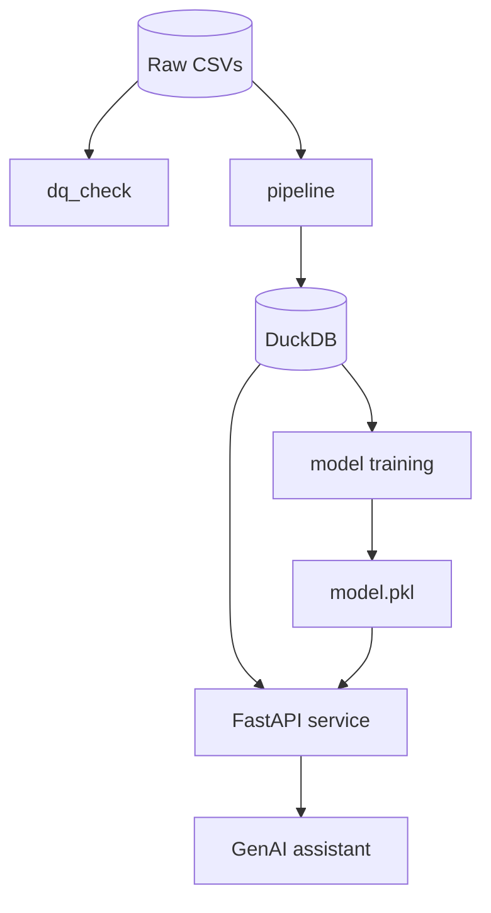

# Supply Chain Intelligence Mini-Platform

A production-ready thin slice of an end-to-end supply chain intelligence platform. The repo ingests and profiles raw shipping data, stores it in DuckDB, trains a delay-risk model, exposes a FastAPI service, and supports a GenAI assistant for route and shipment analysis.

## What is included

- Data profiling and quality checks for raw logistics CSV files
- ETL pipeline to curate shipments, ports, and port events into DuckDB
- ML training pipeline with a gradient-boosting delay-risk model
- FastAPI analytics and prediction endpoints
- CLI assistant that can query route stats, shipment history, and delay forecasts
- Docker Compose setup for a one-command local deployment

## Repository structure

```text
.
├── .github/workflows/train.yaml
├── data/
│   ├── ports.csv
│   ├── shipments.csv
│   └── port_events.csv
├── src/
│   ├── agent/
│   ├── api/
│   ├── data/
│   ├── ml/
│   └── cli.py
├── Dockerfile
├── docker-compose.yml
├── pyproject.toml
├── requirements.txt
├── README.md
├── dq_report.json
├── model.pkl
├── supply_chain.db
├── tests/
└── Take_Home_Assignment.pdf
```

## Quick start

### 1) Install dependencies

```bash
python -m venv .venv
source .venv/bin/activate   # Windows: .venv\Scripts\activate
pip install --upgrade pip
pip install -e ".[dev]"
```

### 2) Build the data-quality report

```bash
python -m src.data.dq_check --input ./data
```

This generates `dq_report.json` at the repository root.

### 3) Ingest data into DuckDB

```bash
python -m src.data.pipeline --input ./data
```

This creates or refreshes `supply_chain.db` in the repository root.

### 4) Train the ML model

```bash
python -m src.ml.train
```

This generates `model.pkl` in the repository root.

### 5) Run the API locally

```bash
uvicorn src.api.main:app --reload --port 8000
```

Then visit:

- `http://localhost:8000/health`
- `http://localhost:8000/docs`

### 6) Run the tests

```bash
pytest tests/
```

### 7) Start the GenAI assistant

```bash
export GEMINI_API_KEY=your_api_key
python -m src.agent.assistant
```

## Docker Compose

```bash
docker compose up --build
```

This starts the FastAPI service on `http://localhost:8000`.

## Key endpoints

- `GET /health`
- `GET /data-quality/report`
- `GET /shipments`
- `GET /shipments/{shipment_id}`
- `GET /routes/{origin}/{destination}/stats`
- `POST /predict-delay`

## Important runtime note

The project now resolves generated artifacts and the database relative to the repository root instead of the current shell location. This avoids failures when the app is launched from a different working directory.

## CI and validation

The repository includes a GitHub Actions workflow in `.github/workflows/train.yaml` that checks:

- data quality generation
- ETL pipeline execution
- model training
- Python linting and packaging
- Docker image build

## Data quality summary

The default checks include:

- missing planned departures
- arrival before departure
- negative shipment weights
- missing timezone info
- negative delay values

## Architecture summary



## Production considerations

This is a lightweight mini-platform, not a full enterprise logistics platform. For larger production workloads, the next steps would include:

- managed PostgreSQL or ClickHouse for serving
- streaming ingestion for event data
- model versioning and deployment automation
- VPC/secret management for API keys and credentials

## License

This project is licensed under the MIT License.

    