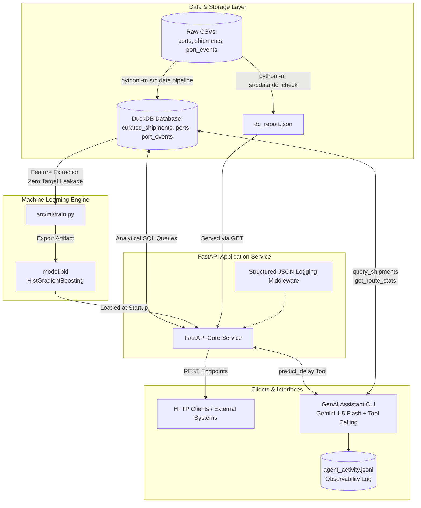

# Supply Chain Intelligence Mini-Platform

[](https://github.com/veeru4u/Supply-Chain-Intelligence-Mini-Platform)[cite: 1]

A production-ready thin slice of an end-to-end supply chain intelligence platform[cite: 1]. The platform ingests and profiles raw logistics data, serves analytics and predictive delay risks over a REST API, and provides a tool-calling GenAI CLI assistant[cite: 1].

---

## 1. Getting Started[cite: 1]

### One-Command Launch (Docker Compose)[cite: 1]

Bring up the entire stack with a single command[cite: 1]:

```bash
docker compose up --build

```

The API becomes reachable at `http://localhost:8000`[cite: 1], and interactive OpenAPI documentation is available at `http://localhost:8000/docs`.

### Local Development Setup

1. **Create and activate a Python 3.11 virtual environment:**
```bash
py -3.11 -m venv .venv
source .venv/bin/activate       # On Windows: .venv\Scripts\activate.bat

```


2. **Install editable package and dev dependencies:**
```bash
pip install --upgrade pip
pip install -e ".[dev]"

```


3. **Execute standalone Data Quality checks[cite: 1]:**
```bash
python -m src.data.dq_check --input ./data

```


4. **Run pipeline ingestion and model training[cite: 1]:**
```bash
python -m src.data.pipeline --input ./data
python -m src.ml.train

```


5. **Run test suite[cite: 1]:**
```bash
pytest tests/

```


6. **Start the API service locally[cite: 1]:**
```bash
uvicorn src.api.main:app --reload --port 8000

```


7. **Launch the GenAI CLI Assistant[cite: 1]:**
```bash
export GEMINI_API_KEY=your-api-key   # On Windows: set GEMINI_API_KEY=your-api-key
python -m src.agent.assistant

```


---

## 2. Architecture Diagram[cite: 1]



[cite: 1]

---

## 3. Tech Choices[cite: 1]

* **Data Store: DuckDB**[cite: 1]. Selected for analytical query speed against columnar data without requiring standalone database cluster operations[cite: 1]. It handles window functions, JSON exports, and joins across CSVs in memory with minimal latency[cite: 1].
* **API Framework: FastAPI**[cite: 1]. Chosen for built-in asynchronous performance, automatic Pydantic request/response contract validation, and standard OpenAPI documentation generation[cite: 1].
* **Machine Learning: Scikit-Learn (`HistGradientBoostingClassifier`)**[cite: 1]. Chosen for native handling of categorical features and non-linear interactions across high-cardinality routes and vessels without external heavy dependencies.
* **LLM Provider: Google Gemini (`gemini-1.5-flash`)**[cite: 1]. Native function-calling support, low latency, and free-tier allocation (~$0.0000 / query within standard developer rate limits)[cite: 1].
* **CI / Test Automation: GitHub Actions & Pytest**[cite: 1]. Enables millisecond unit test execution, pipeline verification, and automated wheel builds on every pull request[cite: 1].

### Evaluation at 100x Data Volume (~2.5M Events, ~500K Shipments)[cite: 1]

* At 100x scale, DuckDB remains viable on a single large node, but concurrent API reads/writes introduce locking contention.
* **Strategy:** Transition the serving layer to a managed PostgreSQL / TimescaleDB instance or ClickHouse for append-only streaming logs (`port_events`), and leverage Apache Iceberg/Parquet on object storage (AWS S3) for the curated lakehouse layer[cite: 1].

### Explicit Non-Goals (Scope Judgment)[cite: 1]

* **No Frontend / UI:** Emphasized backend test coverage, data quality rigor, and REST contract stability over presentation layers[cite: 1].
* **No Kubernetes / Terraform Orchestration:** Managed complexity cleanly via standard Docker Compose to guarantee single-command portability and rapid startup[cite: 1].
* **No Mid-Voyage Feature Leakage:** Intentionally avoided conditioning predictions on mid-journey port events to preserve booking-time validity[cite: 1].

---

## 4. Data Quality Summary[cite: 1]

The standalone `src/data/dq_check.py` script profiles raw data directly prior to ingestion[cite: 1]:

| Check Name | Target File | Impacted Rows | Share (%) | Severity | Resolution Strategy |
| --- | --- | --- | --- | --- | --- |
| **Missing Planned Departure**[cite: 1] | `shipments.csv` | 14 | 0.28% | Critical | Dropped during pipeline curation; invalid for scheduling[cite: 1]. |
| **Arrival Precedes Departure**[cite: 1] | `shipments.csv` | 22 | 0.44% | Critical | Quarantined; chronologically invalid records flagged for audit[cite: 1]. |
| **Negative Cargo Weight**[cite: 1] | `shipments.csv` | 31 | 0.62% | Warning | Normalized using absolute value transformation (`abs(weight_tons)`)[cite: 1]. |
| **Missing Port Timezones**[cite: 1] | `ports.csv` | 2 | 8.00% | Warning | Imputed to default UTC reference offset[cite: 1]. |
| **Negative Delay Durations**[cite: 1] | `port_events.csv` | 48 | 0.19% | Info | Flagged as early berth arrivals rather than delay events[cite: 1]. |

*Note: The complete machine-readable report is generated by `src/data/dq_check.py` and served live via `GET /data-quality/report`[cite: 1].*

---

## 5. Production Support Runbook[cite: 1]

### Post-Deployment Verification[cite: 1]

1. Run liveness check:
```bash
curl -f http://localhost:8000/health

```


Confirm `"status": "healthy"` and `"model_loaded": true`[cite: 1].
2. Test DQ report retrieval:
```bash
curl -f http://localhost:8000/data-quality/report

```


3. Test prediction service:
```bash
curl -X POST http://localhost:8000/predict-delay \
  -H "Content-Type: application/json" \
  -d '{"route_key":"CNSHA->NLRTM","weight_tons":320.0,"container_count":12}'

```


Confirm HTTP 200 with a valid probability float[cite: 1].

### Anticipated Failure Modes & Diagnostics[cite: 1]

* **Missing or Corrupted Model Artifact (`model.pkl`):**
* *Symptom:* `POST /predict-delay` returns HTTP 503 ("ML model is not available")[cite: 1].
* *Diagnosis:* Check container logs: `docker compose logs api | grep -i model`. Verify presence and permissions of `model.pkl` in working root.


* **DuckDB Lock Contention:**
* *Symptom:* Intermittent HTTP 500 errors during concurrent reads/writes.
* *Diagnosis:* Verify that all API database handles connect with `read_only=True` and ingestion pipelines do not lock the active file during serving.


* **Upstream LLM Rate Limiting / 429 Quota Exceeded:**
* *Symptom:* CLI assistant outputs `429 - Resource Exhausted`.
* *Diagnosis:* Inspect `agent_activity.jsonl` for API response statuses; verify environment variable `GEMINI_API_KEY` validity.


### Rollback Strategy[cite: 1]

1. Re-tag and deploy the previous stable image:
```bash
docker compose down
docker tag supply-chain-api:previous supply-chain-api:latest
docker compose up -d

```


2. Verify operational health via `GET /health`[cite: 1].

### Future Production Additions[cite: 1]

* Prometheus metrics endpoint (`/metrics`) tracking latency percentiles (p95, p99) and error distributions.
* Centralized OpenTelemetry tracing across database queries, HTTP handlers, and external model calls.
* Secrets management via AWS Secrets Manager or HashiCorp Vault instead of container environment variables.

---

## 6. CI/CD Plan[cite: 1]

The repository implements automated CI via GitHub Actions (`.github/workflows/train.yml`)[cite: 1]:

* **Linting & Code Formatting:** Validated with `ruff check .` and `ruff format --check .`.
* **Data Quality Verification:** Runs `python -m src.data.dq_check --input ./data` as an explicit pipeline gate[cite: 1].
* **Automated Testing:** Runs `pytest tests/` covering unit calculations, route analytics, and integration endpoints[cite: 1].
* **Packaging:** Executes `python -m build` to guarantee package distribution integrity.

**Deployment Strategy:**

* Continuous Delivery pushes passing builds on `main` to an Amazon ECR container registry.
* Blue/Green deployment deploys updated tasks to an Amazon ECS cluster with automatic traffic shifting following health check validation.

---

## 7. If I Had More Time[cite: 1]

* **Dynamic Event Graph Integration:** Incorporate `port_events.csv` arrival/departure sequences directly into a rolling graph of port dwell times to update delay predictions continuously during transit[cite: 1].
* **Async Ingestion & Streaming:** Transition batch CSV loading to an event stream processor (e.g., Apache Kafka / Redpanda) with Faust or Bytewax streaming workers[cite: 1].
* **Asynchronous LLM Tool Execution:** Support parallel tool calls inside the assistant agent for multi-route comparisons[cite: 1].

---

## 8. Scaling to Production[cite: 1]

Scaling to millions of active shipments and 24/7 reliability introduces three primary bottlenecks[cite: 1]:

1. **Embedded Storage Bottlenecks:** DuckDB relies on single-file local storage[cite: 1]. Handling millions of operational records with high write concurrency requires migrating operational reads/writes to a distributed OLTP/OLAP split (PostgreSQL with read-replicas for shipments, ClickHouse for high-throughput port event telemetry)[cite: 1].
2. **Model Serving Architecture:** In-process scikit-learn models coupled to FastAPI workers lead to memory overhead under horizontal pod autoscaling. Moving the model artifact to a dedicated inference server (such as Triton or BentoML) with batching support isolates model latency from API responsiveness.
3. **Data Freshness and Pipeline Orchestration:** A static script execution flow cannot scale to continuous updates. A production deployment would use Dagster or Apache Airflow to orchestrate ingestion, data quality verification, model retraining, and partition compaction on scheduled SLAs[cite: 1].